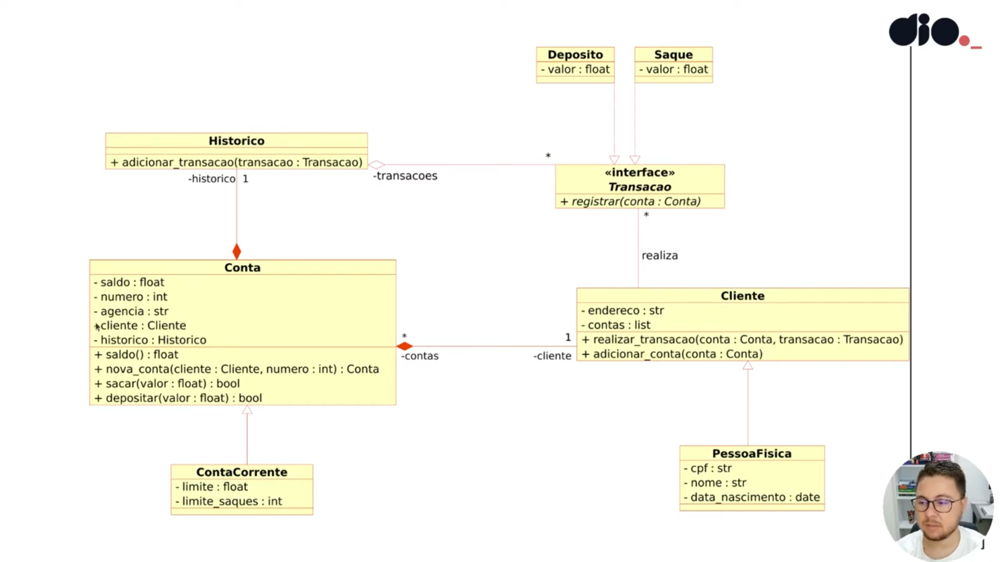

# Banco

## Mapa

## Exigencias

### Modelagem em Programação Orientada a Objeto

### Base do codigo no UML da imagem

### Classe Conta
- cinco atributos
- quatro métodos
- Retorna objeto conta

## Interface (transação)
- Classe abstrata
- Metodo Registrar
- Classe deposito e saque implementam transacao

## OBS
- "-" Atributo
- "+" é metodo
- objetivo: validar herança, classe abstrata, poliformismo

## Interpretação do UML

### Classe Conta

#### *Propriedades:*

- saldo (float)
- numero (int)
- agencia (str)
- cliente (Classe Cliente?)
- historico (Classe Historico?)

#### *Metodos:*

- saldo() (float)
- nova_conta(client: Cliente, numero:int) : Conta (gera numero de conta?)
- sacar(Valor:Float) (bool)
- depositar (Valor:Float) (bool)

### Classe ContaCorrente(Conta)

#### *Propriedades:*

- limite(float)
- limite_saques(int)

### Classe Cliente

#### *Propriedades:*

- endereço (str)
- contas (list)

#### *Metodos:*

- realizar_transacao(conta:Conta,transacao:Transacao) if
- adicionar_conta(conta:Conta) else

### Classe PessoaFisica(Cliente)

#### *Propriedades:*

- cpf(str)
- nome(str)
- data_nascimento(date)

### Classe Historico

#### *Metodos:*

- adicionar_transacao(transacao: Transacao)

### Classe Transacao(Abstrata)

#### *Metodos:*

- registrar (conta:Conta)

### Classe Deposito(Transacao)

#### *Propriedades:*

- valor (float)

### Classe Saque(Transacao)

#### *Propriedades:*

- valor (float)